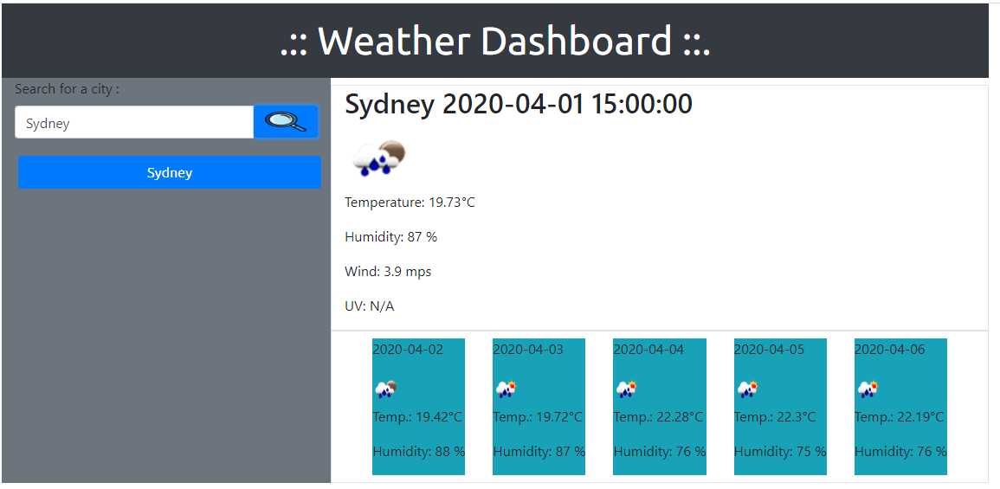

# Weather dashboard

Simple weather dashboard.

## Getting Started

Open the web browser and weather dashboard will be ready. Type in the name of the city and click search.
After a while, current weather will be displayed on the right. Below, you will see a 5 day weather forecast.
Please note, if UV index is marked as N/A that means you have extedned the number of call to UV API (there are maximum 50 per day).

Your search history will be saved on the left. Once you re-open the web page, the last city will be displayed.

If you don't provide the name of the city, the left field will be marked as red.

## Prerequisities

You just need a web browser. The project was tested on:
* desktop Chrome
* mobile Chrome (fonts are not responsive)

### Example

### Built with

To build this project I used:
* static html
* bootstrap
* custom css
* javascript (jQuery) managing DOM
* local storage
* two free APIs: https://openweathermap.org/ and https://www.openuv.io/.